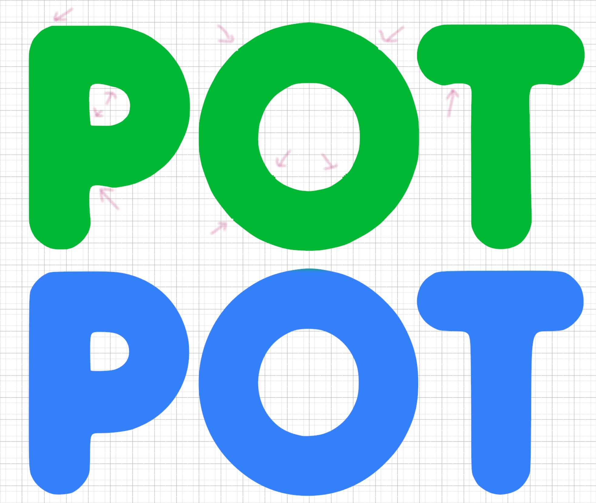
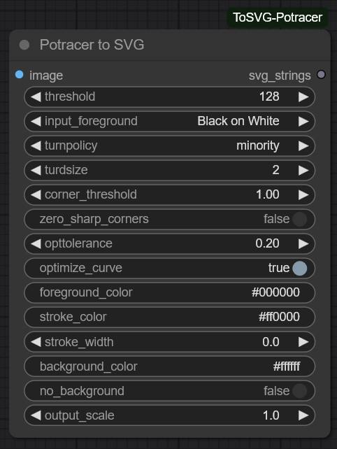
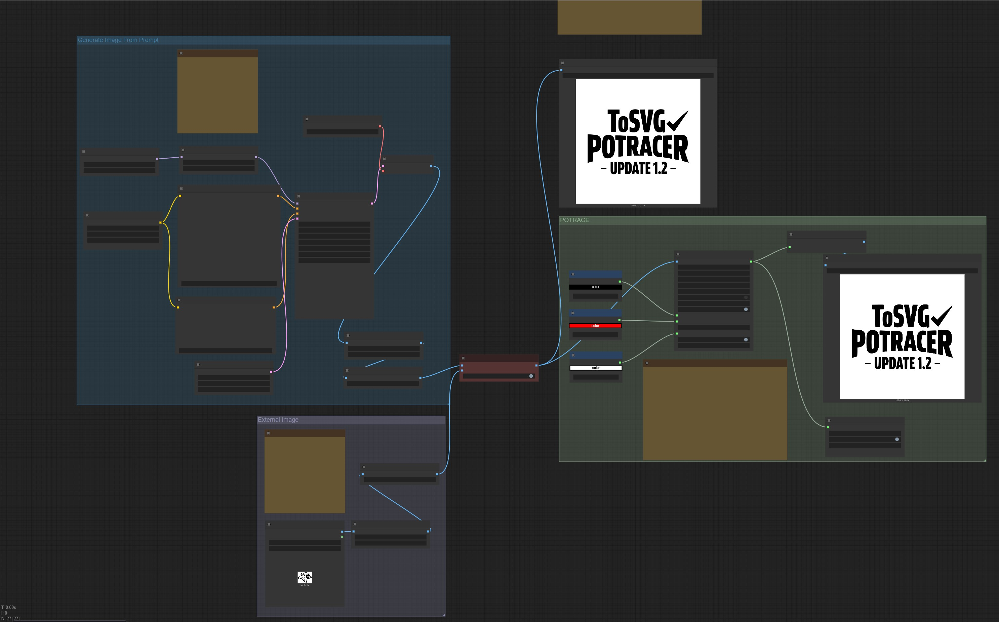
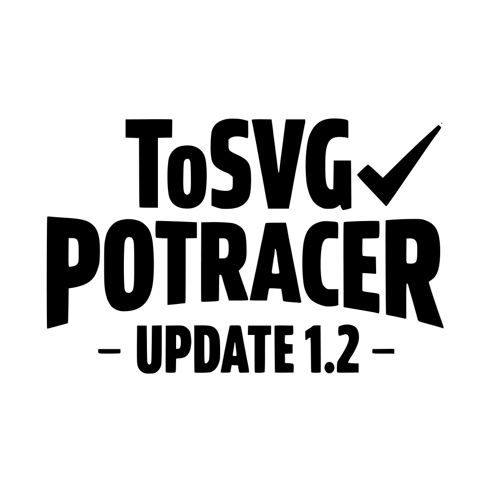
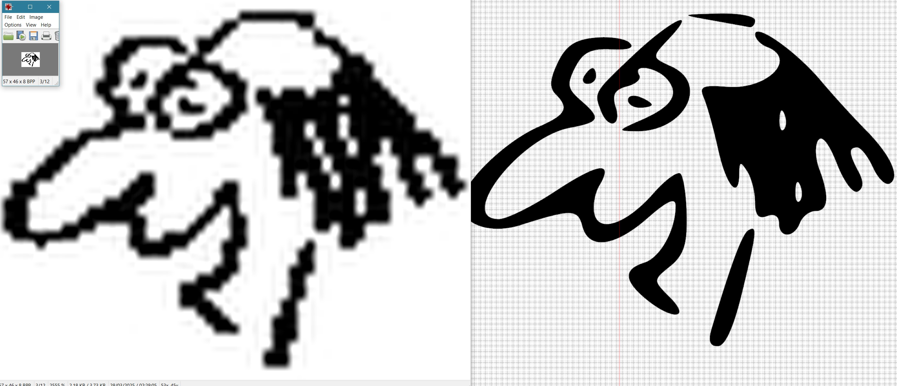

# **UN**official ComfyUI Potrace(r) SVG conversion

- [**UN**official ComfyUI Potrace(r) SVG conversion](#unofficial-comfyui-potracer-svg-conversion)
  - [Comparing Vtracer and Potrace](#comparing-vtracer-and-potrace)
  - [Installation](#installation)
  - [Intended Usage](#intended-usage)
  - [Workflows](#workflows)
    - [1. **Txt2Img to SVG Potracer Example Workflow**](#1-txt2img-to-svg-potracer-example-workflow)
      - [**Workflow details**](#workflow-details)
      - [Alternative Route](#alternative-route)
  - [Sources, Shoutouts, Love and Inspiration](#sources-shoutouts-love-and-inspiration)
  - [CHANGENOTES (BREAKING!!!)](#changenotes-breaking)
  - [To Do](#to-do)
  - [Disclaimer](#disclaimer)
  - [License](#license)

I created this custom node because i wasn't getting the results I needed for my usecase when using the [ComfyUI-ToSVG node by Yanick112](https://github.com/Yanick112/ComfyUI-ToSVG) and the [Flux Text to Vector Workflow](https://openart.ai/workflows/odam_ai/flux-text-to-vector-turn-your-images-into-svg-dev-gguf/duJDP3ljuMaWv9cLSkY3) by Stonelax. A big thanks to them for their work and inspiring me to try my own node.

Not getting the results I want is NOT a complaint; 
ComfyUI-toSVG implements the VTracer logic, and this works great for multicolor and detailed images.  
For logo's, text, etc. I found [Potrace SVG conversion by Peter Selinger](https://potrace.sourceforge.net/) better suited, with the caveat that it only handles 2 colors; a Foreground and Background.  
I also found Potrace optimizes shapes differently, creating fewer vector-points and needing almost to no cleanup when loading the SVG into vector design software.

Potracer to SVG node traces a raster image (IMAGE) into an SVG vector graphic using the ['potracer'](https://github.com/tatarize/potrace) pure Python library for POTRACE by Tatarize. (I may mix up the terms 'potrace' and 'potracer' at times)

## Comparing Vtracer and Potrace

While each user and route will have their specific usecase, my usecase is creating designs for Vinylcutters and logos. This usecase requires sharp images, fluid shapes and clear separation of fore and background. It is also vital to have the lines and curves smooth, with as few vectors as possible while staying true to the form.

| | |
| :-------------: | :-------------: |
| Artifacts | Vector points |
|  |  |
|*Vtracer (Green, Top) shows significantly more artifacts, hard edges or straight lines, and irregular traces compared to Potracer (Blue, Bottom), which stays true to the original form.*|*Vtracer has significantly more vector points compared to the optimized Potracer version.*|

For usecases where Vtracer suits best, go check out https://github.com/Yanick112/ComfyUI-ToSVG/, where Yanick explains the workings in detail.

In short; As Potrace converts the image to 1 foregroundcolor and 1 backgroundcolor, it is pretty much unusable for any image requiring more than one color, especially photos.

## Installation

Due to both usecases for SVG export are very valid when working with ComfyUI, I opted to keep the naming and category alike for easier navigation.
>***note: This node requires Requires ***LATEST VERSION*** of [Yanick112's ComfyUI-ToSVG](https://github.com/Yanick112/ComfyUI-ToSVG/) --> SaveSVG node to save the SVGfile and VectorToRaster node if you want to reconstruct the SVG to an image if you want to see the result in ComfyUI. See his repository for install instructions***

- Using ComfyUI Manager --> Custom Node Manager --> Search for:

        ComfyUI-ToSVG-Potracer
        Comfyui-ToSVG
- Using comfyregistry manual installation:

        comfy node registry-install ComfyUI-ToSVG-Potracer
        comfy node registry-install ComfyUI-ToSVG
- Manual Installation (ToSVG-Potracer only)
  1. Navigate to your /ComfyUI/custom_nodes/ folder.
  2. Run the following command to clone the repository:

          git clone https://github.com/ImagineerNL/ComfyUI-ToSVG-Potracer

  3. Navigate to your ComfyUI-ToSVG-Potracer folder.
       - Command for Portable/venv:

             path/to/ComfUI/python_embeded/python.exe -s -m pip install -r requirements.txt

       - Command for system Python:

             pip install -r requirements.txt
  4. Visit <https://github.com/Yanick112/ComfyUI-ToSVG> for installation of ComfyUI-ToSVG

## Intended Usage

The input image should only use 2 distinct colors (e.g. black and white). If other pixel values appear in the input, they will be converted to black and white using a simple threshold method. You can set the Foreground and Background colors for the svg. 

Outputs svg strings as 1 flat shape (as a compound path). Should you want to adjust the shapes by hand, currently, when you release the path in vector design software, the 'internal openings' become filled shapes. This is easy to fix using the boolean tools and substract. My main usecase is Silhouette Studio for vinylcutting and especially with 'zero_sharp_corners' set to true, i don't need to do any postprocessing on the shape.  

| Parameter                	| Usage                                                                                                  	| Default        	|
|--------------------------	|--------------------------------------------------------------------------------------------------------	|:----------------:	|
| **threshold**            	| *Brightness cutoff (0-255) for binarization to B/W.*                                                   	| 128            	|
| **input_foreground**    	| *Defines if the input image is a Black object on White background or White on Black background*        	| Black on White 	|
| **turnpolicy**          	| *How to resolve ambiguities in path decomposition*                                                     	| minority       	|
| **turdsize**            	| *Suppress speckles of up to this many pixels*                                                          	| 2              	|
| **corner_treshold**     	| *Smaller values = sharper corners*                                                                     	| 1              	|
| **zero_sharp_corners**  	| *Forces al corners to be fluid (sets corner_treshold = 1.34 in backend)*                                      	| false          	|
| **opttolerance**        	| *Curve optimization tolerance*                                                                         	| 0.2            	|
| **optimize_curve**      	| *Curve optimization, joins adjacent Bezier curve segments where possible. Reduces filesize and points* 	| true           	|
| **foreground_color**    	| *Defines foreground color after trace #rrggbb* | #000000         |
| **stroke_color**        	| *Defines stroke color after trace #rrggbb / none (only used when stroke_width > 0.0) | #ff0000        	|
| **stroke_width**        	| *Sets a stroke width/outline for the traced shapes (only valid when stroke_color <> none) | 0.0 |
| **background_color**    	| *Defines background color after trace #rrggbb / none* | #ffffff |
| **no_background**       	| *Removes the background color (sets background_color to 'none' in backend)* | false |
| **output_scale** | *Scale the output SVG string by a factor X for resizing* |1.0|
| | | |
| **svg_strings**           | *A set of strings that can be converted to svg shape by connecting it to the ComfyUI-ToSVG --> SaveSVG node*| |

## Workflows

### 1. **Txt2Img to SVG Potracer Example Workflow**

| |
| :-------------: |
|    *The above image is just a visualisation, does not contain workflow*  *Workflow based on the [Flux Text to Vector Workflow](https://openart.ai/workflows/odam_ai/flux-text-to-vector-turn-your-images-into-svg-dev-gguf/duJDP3ljuMaWv9cLSkY3) by Stonelax* |
||
|    *drag/drop in ComfyUI*   [Example Workflow V1.2 JSON](example_workflows/example_ToSVG_Potracer_V1.2)   [Example Workflow V1.2 PNG](ComfyUI_ToSVG_Potrace_Workflow_V1.2.png)   [Example Workflow V1.2 on OpenArt.ai PNG]([ComfyUI_ToSVG_Potrace_Workflow_V1.2.png](https://openart.ai/workflows/koala_speedy_95/txt2img-to-svg-potracer-vector-conversion-example-workflow/bnoXqmR1qQFtBAOCYqod)) |

#### **Workflow details**

The node is model independent, but I'm getting great results using FLux. However, Flux Dev sometimes has trouble with white backgrounds and creates blurry images. Defining a different color background can help a lot with that. Make sure your input image is as clean as possible. Describe your prompt accordingly

>- **Model**: Flux_dev (t5xxl_fp8_e4m3fn / clip_l)
>- **Settings**:  
Euler - Simple 
Steps - 25-30 
Latent Image size - 1024x1024 
Distilled CFG Scale - 3.5 
CFG - 1 
Comfyui-various - Image Contrast: 1.5 - 2
>- **Lora**: [Simple_Vector_Flux_v2_renderartist](https://civitai.com/models/785122/simple-vector-flux) 
Trigger keyword: v3ct0r , vector 
Recommended strengths: 0.6 - 0.9
>- **Lora**: [Simple_Vectors_Flux_by_Sarcastic_TOFU](https://civitai.com/models/1329550/simplevectorsfluxbysarcastictofu)  
Trigger keyword: Simple_Vectors_Flux
>- **Lora**: [Textimprover-FLUX-V0.4](https://civitai.com/models/793052)  
Trigger: aidmaTextImprover  
Strength: 0.3 - 1
>- **LORA**: [v3ctora (Vector art & Line art (Flux))](https://civitai.com/models/686231/vector-art-and-line-art-flux)  
Trigger: v3ctora style
>- **Prompt tips**:  
Style: Bold, clean, smooth letters with rounded corners, solid fills (no texture), black on white, high contrast 
Theme: Typography, large bold lettering, playful, dynamic 
Text: With the text: "YOUR TEXT" 
colors: black, white 
Background: Clean white, simple design, no extra details

#### Alternative Route

For the second option in this workflow; you load an existing 2 color image of an icon/text and can convert it to SVG.
You can use an upscale node for the input image, but I found it *rarely* improves quality; in fact, it is usually worse than the original. 
It usually helps more to clean up the contrast, especially with highly compressed jpg images.
The output svg can be scaled using the `output_scale` parameter  
>  
>*zoomed in original jpg vs default settings Potracer SVG conversion reference*

## Sources, Shoutouts, Love and Inspiration

- Potrace by Peter Selinger: <https://potrace.sourceforge.net/>
- Potrace Pure Python by Tatarize: <https://github.com/tatarize/potrace>
- ComfyUI-ToSVG by Yanick112: <https://github.com/Yanick112/ComfyUI-ToSVG>
- StabilityMatrix: <https://github.com/LykosAI/StabilityMatrix>
- [Flux Text to Vector Workflow](https://openart.ai/workflows/odam_ai/flux-text-to-vector-turn-your-images-into-svg-dev-gguf/duJDP3ljuMaWv9cLSkY3) by <Stonelax@odam.ai>
- Gemini AI

## CHANGENOTES (BREAKING!!!)
- V1.0.0 Initial release
- V1.2.0 BREAKING / FIXING CHANGE: Output LIST --> Output String 
  Yanick112's ToSVG Node switched recently from LIST to String. V1.0.0 didn't account for that. 
  ComfyUI-ToSVG has the 'nightly' version in ComfyUI Custom Node Manager, and therefor doesn't do versioning.
  -  Update package; in your workflow: rightclick recreate node or Reload example workflow (V1.2).; It should connect now to ToSVG nodes.
  -  If it DID work before and now it doesn't, update the ComfyUI-ToSVG Package.

## To Do

- [X] Deploy V1 to Github
- [X] Deploy to Comfyregistry
- [X] Add Output Scale factor (v1.1)
- [ ] Real life testing & feedback

## Disclaimer

This is my First ever (public) ComfyUI node.
While tested thoroughly, and as with all custom nodes, **USE AT YOUR OWN RISK**.

While tested a lot and I have IT knowledge, I am no programmer by trade. This is a passion project for my own specific usecase and I'm sharing it so other people might benefit from it just as much as i benefitted from others. I am convinced this implementation has its flaws and it will probably not work on all other installations worldwide.
I can not guarantee if this project will get more updates and when. 

## License

"Potrace" is a trademark of Peter Selinger. "Potrace Professional" and "Icosasoft" are trademarks of Icosasoft Software Inc. Other trademarks belong to their respective owners.

This program is free software; you can redistribute it and/or modify it under the terms
of the GNU General Public License as published by the Free Software Foundation;
either version 2, or (at your option) any later version.

Furthermore, this program calls the Potrace Python Library by Tatarize,
which is permitted to be relicensed under any terms the Peter Selinger's
original Potrace is licensed under.
If he broadly publishes the software under a more permissive license the Potrace Pyton
port should be considered licensed as such as well, as well as this program.

Further, if you purchase a proprietary license for inclusion within commercial
software under Peter Selinger's Dual Licensing program your use of this software
shall be under whatever terms he permits for that. 
Any contributions to this port must be made under equally permissive terms.

The above copyright notice and this permission notice shall be included in all
copies or substantial portions of the Software.

THE SOFTWARE IS PROVIDED "AS IS", WITHOUT WARRANTY OF ANY KIND, EXPRESS OR
IMPLIED, INCLUDING BUT NOT LIMITED TO THE WARRANTIES OF MERCHANTABILITY,
FITNESS FOR A PARTICULAR PURPOSE AND NONINFRINGEMENT. IN NO EVENT SHALL THE
AUTHORS OR COPYRIGHT HOLDERS BE LIABLE FOR ANY CLAIM, DAMAGES OR OTHER
LIABILITY, WHETHER IN AN ACTION OF CONTRACT, TORT OR OTHERWISE, ARISING FROM,
OUT OF OR IN CONNECTION WITH THE SOFTWARE OR THE USE OR OTHER DEALINGS IN THE
SOFTWARE.
